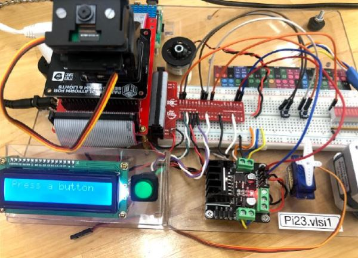
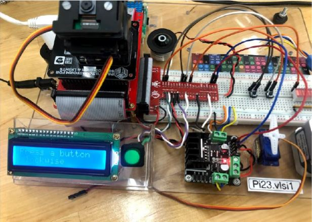
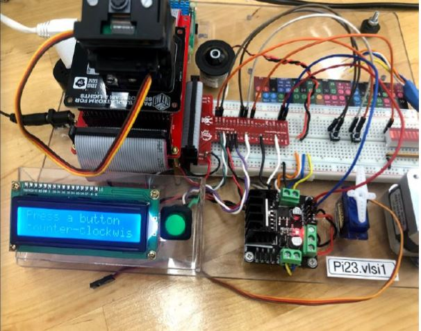
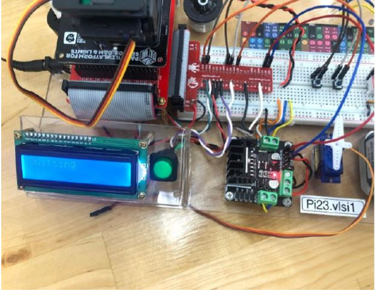

# Raspberry PI Projects

by Bardia Parmoun

## DESCRIPTION
- This repository is a collection of some of the raspberry PI projects that I have worked on 
- These projects deal with different components such as LEDS, buttons, LCD, buzzer, servo motors, stepper motors, and DC motors

## Examples

- Here is an example of using the DC motor program:
  
1. The program waiting for the user input

2. When the clockwise button is pressed the motor starts turning clockwise 

3. When the counter clockwise button is pressed the motors starts turning counter clockwise

4. When a key on the keyboard is pressed the program ends

## CREDITS
Author: Bardia Parmoun

Copyright © 2021 Bardia Parmoun. All rights reserved
